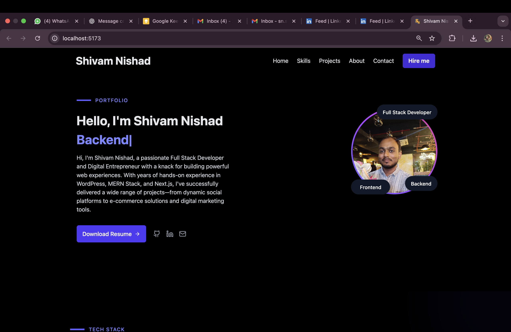

# Shivam Nishad - Portfolio

A modern, responsive personal portfolio website showcasing my journey as a Full Stack Developer. Built with cutting-edge technologies to deliver a seamless user experience with beautiful animations and interactive elements.



## Features

- **Modern Design**: Clean, professional design with smooth animations and transitions
- **Dark/Light Mode**: Automatic theme switching with user preference persistence
- **Fully Responsive**: Optimized for all devices - mobile, tablet, and desktop
- **Fast Performance**: Built with Vite for lightning-fast development and builds
- **Interactive Elements**: Typing animation, floating tags, and hover effects
- **Type-Safe**: Written in TypeScript for better code quality and developer experience
- **Featured Projects**: Showcase of key projects with live demos and GitHub links
- **Skills & Experience**: Comprehensive overview of technical skills and professional journey
- **Contact Integration**: Direct links to social media and email

## 🛠️ Tech Stack

### Frontend
- **React 19** - Modern React with latest features
- **TypeScript** - Type-safe JavaScript
- **Tailwind CSS** - Utility-first CSS framework
- **Vite** - Fast build tool and dev server

### UI Components & Icons
- **@traken-ui/react** - Custom UI component library
- **Lucide React** - Beautiful icon library
- **React Syntax Highlighter** - Code syntax highlighting

### Development Tools
- **ESLint** - Code linting
- **Vite** - Build tool and dev server
- **TypeScript ESLint** - TypeScript linting

## Getting Started

### Prerequisites
- Node.js (v18 or higher)
- npm or yarn

### Installation

1. **Clone the repository**
   ```bash
   git clone https://github.com/ShivamNishad0/portfolio.git
   cd portfolio
   ```

2. **Install dependencies**
   ```bash
   npm install
   ```

3. **Start the development server**
   ```bash
   npm run dev
   ```

4. **Open your browser**
   Navigate to `http://localhost:5173` (or the port shown in your terminal)

### Build for Production

```bash
npm run build
```

The built files will be in the `dist` directory, ready for deployment.

## 📁 Project Structure

```
portfolio/
├── public/                 # Static assets
│   ├── favicon.ico
│   ├── IMG_2834.jpg       # Profile image
│   ├── Resume.pdf         # Resume download
│   └── *.png              # Project screenshots
├── src/
│   ├── components/
│   │   └── portfolio/     # Portfolio components
│   │       ├── PortfolioHeroSection.tsx
│   │       ├── PortfolioProjects.tsx
│   │       ├── PortfolioAbout.tsx
│   │       ├── PortfolioSkills.tsx
│   │       ├── PortfolioContact.tsx
│   │       ├── PortfolioFooter.tsx
│   │       ├── PortfolioNavbar.tsx
│   │       └── styles/
│   ├── contexts/          # React contexts
│   │   └── ThemeContext.tsx
│   ├── pages/             # Page components
│   │   └── Portfolio.tsx
│   ├── App.tsx            # Main app component
│   ├── main.tsx           # App entry point
│   └── index.css          # Global styles
├── package.json
├── vite.config.ts
├── tailwind.config.js
└── README.md
```

## Key Components

### PortfolioHeroSection
- Animated introduction with typing effect
- Social media links and resume download
- Profile image with floating skill tags

### PortfolioProjects
- Featured projects grid with hover effects
- Project cards with images, descriptions, and tech stacks
- Direct links to GitHub repositories and live demos

### PortfolioAbout
- Professional experience timeline
- Skills showcase with icons
- Technology tags and contact CTA

### PortfolioSkills
- Interactive skills visualization
- Progress indicators and animations

### ThemeContext
- Global theme management (dark/light mode)
- Local storage persistence

## Available Scripts

- `npm run dev` - Start development server
- `npm run build` - Build for production
- `npm run lint` - Run ESLint
- `npm run preview` - Preview production build

## Featured Projects

### Event Scheduler
A full-stack event management application built with PERN stack (PostgreSQL, Express.js, React.js, Node.js).

### Task Tracker
Productivity app with task management, WhatsApp integration, and priority settings.

### DocEase: Recommendation System
Doctor recommendation system with location-based search and payment integration.

### Book World
Book recommendation platform built with Flask and intelligent algorithms.

## Contributing

While this is a personal portfolio, suggestions and improvements are welcome! Please feel free to:

1. Fork the repository
2. Create a feature branch (`git checkout -b feature/amazing-feature`)
3. Commit your changes (`git commit -m 'Add amazing feature'`)
4. Push to the branch (`git push origin feature/amazing-feature`)
5. Open a Pull Request


## 📞 Contact

**Shivam Nishad**

- **Email**: sn.shivamni@gmail.com
- **LinkedIn**: [linkedin.com/in/sn-shivam](https://www.linkedin.com/in/sn-shivam/)
- **GitHub**: [github.com/ShivamNishad0](https://github.com/ShivamNishad0)
- **Portfolio**: [shivamnishadd.netlify.app](https://shivamnishadd.netlify.app)

---

⭐ **Star this repo** if you found it helpful!

Built with ❤️ by Shivam Nishad
